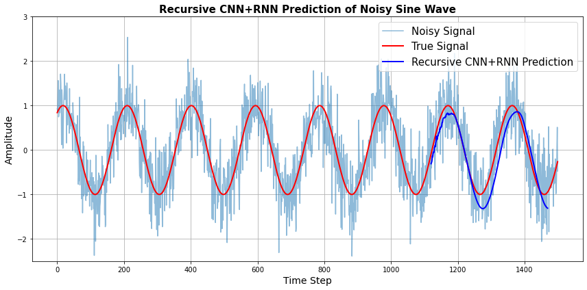

# CNN + RNN Recursive Signal Prediction

This project demonstrates how to combine **Convolutional Neural Networks (CNNs)** and **Recurrent Neural Networks (RNNs)** to perform **recursive prediction** on a noisy sine wave signal. The model is trained on a noisy time series and then used to predict future signal values step-by-step.

---

## Objective

- Use CNN to extract local temporal features from noisy data
- Use RNN to model long-term dependencies
- Predict the future values recursively
- Compare predicted signal to the ground truth sine wave

---

## Why CNN + RNN?

| CNN | RNN |
|-----|-----|
| Captures local patterns and reduces noise | Learns temporal dependencies and sequence structure |
| Fast, good at filtering | Great for sequential prediction |
| Acts like feature extractor | Acts like memory/sequence learner |

By combining both, we benefit from the **noise robustness** of CNN and the **sequence modeling power** of RNN.

---

## Recursive Prediction

In recursive prediction, the model predicts one future value at a time. Each new prediction is then fed back into the model as input to predict the next step. This makes the model sensitive to early prediction errors — called **error propagation**.

---

## How It Works

- Generate a sine wave and add Gaussian noise
- Normalize data using MinMaxScaler
- Prepare sequences of length window_size as input
- Build a model:
- CNN (1D conv layer)
- RNN (SimpleRNN or LSTM/GRU)
- Dense output
- Train using MSE loss
- Predict future values recursively
- Plot and compare with the true signal

---

## Results Visualization



- **Gray**: Noisy input signal
- **Black**: True sine signal
- **Blue**: CNN+RNN recursive prediction

---

## Requirements

- `numpy`
- `matplotlib`
- `tensorflow` / `keras`
- `scikit-learn`

Install with:

```bash
pip install numpy matplotlib tensorflow scikit-learn
```
---

## Author

Sahar Jahani


